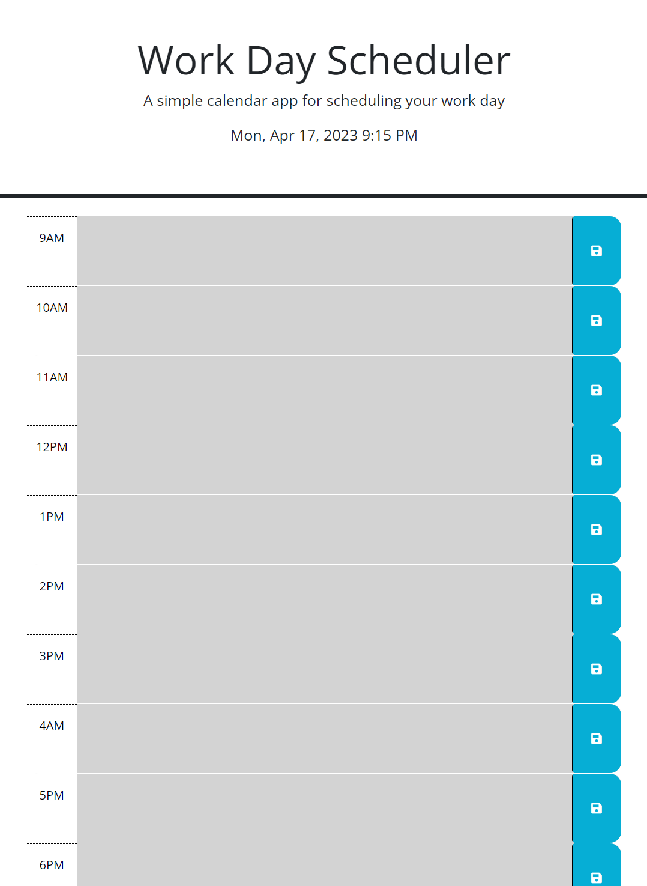

# Work Day Scheduler

## Description

A page that allows you to write tasks for the day, it updates the date and every time block is color coded depending on the time

## Installation

N/A

## Usage

Time blocks that are gray colored are events that have passed, a red colored block indicates that it is the current time, and green colored blocks indicate future events.
Tasks can be written in every time block and when the blue button is clicked, said tasks will be saved 

Here is how it looks:

You can visit the website here: 

https://alejandro-jpeg.github.io/Work-Day-Scheduler/

## Credits

N/A

## License

N/A